This repository features a python script which is able to measure your heartbeat using a webcam or some other camera attached to a computer. Blood flow in the skin plays a role in determining skin color, as for example evident by the reddening of the skin when someone is blushing. Likewise, blood circulation triggers a similar yet far more subtle change in color. 

In the figure below, the underlying principle that we want to exploit has been animated. Blood reflects red light while it strongly absorbs green light. Consequently, the ratio between red and green light forms the basis for the pulse signal. Additionally, we will make use of some additional post-processing techniques described in … to attenuate the effect of specular reflection and make the measurement somewhat motion robust.  

The most convenient location to extract the pulse is the face. Not only is this one of the most pulsatile regions on the body, many face detectors already exist. 

This application can be used for expirements with video pulserate detection.
It features an implementation of the chrominance method described in [1] and the PBV method described in [2]
The user interface was build using a web frontend since its impact on performance is significantly lower than similar interfaces in Python.

